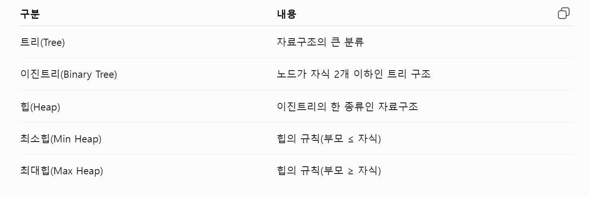

# Heap에대해 배운것 

PriorityQueue<Integer> pq = new PriorityQueue<>();
자료구조의 heap에서 규칙 최소힙을 적용 

PriorityQueue<Integer> pq = 
new PriorityQueue<>(Collections.reverseOrder()); 
규칙을 최대힙으로 적용 

----
이중 Queue문제

여기서 heap2개로 풀어도되는데 2개를 동기화하기 귀찮을것같아서 
Treemap을 추천하더라고 treeMap 정의아래 참고 

HashMap
HashMap<Integer, Integer> map = new HashMap<>();
순서가 없음 

TreeMap
TreeMap<Integer, Integer> map = new TreeMap<>();
키로 정렬이되어있음
 넣은 순서는 5,2,9이지만  내부에서는 2,5,9로 정리되어있음 
map.put(5, 1);
map.put(2, 1);
map.put(9, 1);